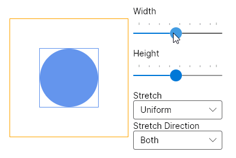

# Viewbox

The `Viewbox` is a decorator control which scales its child. It can be used to scale its child to fit the available space.

The `Viewbox` gives its child infinite space in the measure phase. It will constrain either or both sides when arranging it. This depends on the value of the `Stretch`.

To restrict scaling direction one can use `StretchDirection` which can prevent up or down scaling.

```xml
<!-- Ellipse will occupy 50x50px space -->
<Ellipse Width="50" Height="50" Fill="CornflowerBlue" />  

<!-- Ellipse will be scaled to occupy 300x300px space -->
<Viewbox Stretch="Uniform" Width="300" Height="300">
	<Ellipse Width="50" Height="50" Fill="CornflowerBlue" />  
</Viewbox>
```

```csharp
// Ellipse will occupy 50x50px space
new Ellipse
{
	Width = 50,
	Height = 50,
	Fill = Brushes.CornflowerBlue
};

// Ellipse will be scaled to occupy 300x300px space
new Viewbox
{
	Stretch = Stretch.Uniform,
	Width = 300,
	Height = 300,
	Child = new Ellipse
	{
		Width = 50,
		Height = 50,
		Fill = Brushes.CornflowerBlue
	}
};
```

## Examples



## Common Properties <a id="common-properties"></a>

| Property | Type | Description | Default |
| :--- | :--- | :--- | :--- |
| `Stretch` | [Stretch](http://reference.avaloniaui.net/api/Avalonia.Media/Stretch) |Determines how child fits into the available space | Uniform |
| `StretchDirection` | [StretchDirection](http://reference.avaloniaui.net/api/Avalonia.Media/StretchDirection) | Determines in what direction child will be scaled | Both |

### Pseudoclasses <a id="pseudoclasses"></a>

None

### Reference <a id="reference"></a>

[Viewbox](http://reference.avaloniaui.net/api/Avalonia.Controls/Viewbox/)

### Source code <a id="source-code"></a>

[Viewbox.cs](https://github.com/AvaloniaUI/Avalonia/blob/master/src/Avalonia.Controls/Viewbox.cs)

